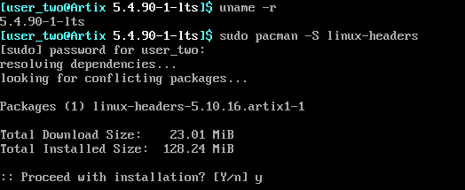
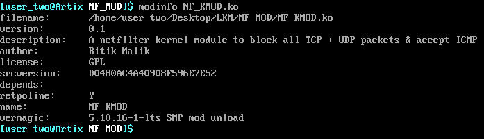
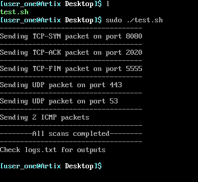
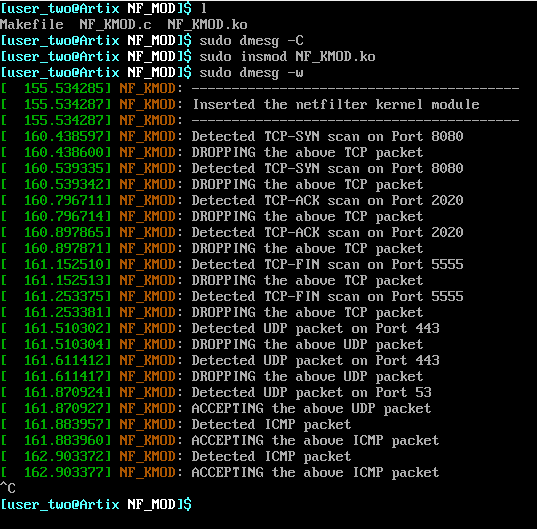

# Linux Kernel Netfilter Framework Module

### Setup
* 2 VMs with separate NAT adapters & host-only adapters to get them in the same subnet
* Both of them running bare-bones Artix Linux with runit
* Kernel version - 5.10.90-1-lts
* VM1 \[50.0.0.3] <-----> \[50.0.0.4] VM2

### On VM 2
* Do a full system upgrade : `sudo pacman -Syu`
* Install linux-lts-headers : `sudo pacman -S linux-lts-headers`
* Install glibc : `sudo pacman -S glibc`
* Reboot

### On VM 1
* Install nmap : `sudo pacman -S nmap`

## Aim
* To make a linux netfilter module in VM 2 & test its working with nmap in VM 1

## The netfilter module - NF_KMOD.c
* The C code for the module - **NF_KMOD.c** is attached along with a **Makefile** & a **test.sh**, test script to be run on VM 1.
* The module does the following task :
  1. DROP all UDP packets except on Port 53
  2. ACCEPT all TCP packets
  3. Identify TCP-SYN, TCP-ACK & TCP-FIN scans
  4. ACCEPT all ICMP packets
  5. ACCEPT everything else
  6. Log all the above
 

* The module does the above task by identifying the IP header of the received packet & then check the protocol type, if it is UDP then check for the Port number, if it is 53, then ACCEPT, else DROP
* If the protocol type is TCP, then it will check all the individual bits to identify SYN scan , ACKscan & FIN scan, and the port number. Then ACCEPT the packet
* If the protocol type is ICMP then it will ACCEPT the packets, and also ACCEPT everything else
* The module will log everything using **printk** which can be cross checked in **dmesg**
* The working with detailed comments can be found in the module itself
  
## The Makefile
The Makefile is attached to compile the above module. It also automatically removes the extra files while leaving only the **NF_KMOD.ko** - the final module to be inserted

## The Test script - test.sh
* This script is to be run in VM 1 to test the module in VM 2
* The script uses nmap to run the following scan (it redirects all outputs to logs.txt) ->
  1. TCP-SYN scan on port 8080
  2. TCP-ACK scan on port 2020
  3. TCP-FIN scan on port 5555
  4. UDP scan on port 443
  5. UDP scan on port 53
  6. Ping the target 2 times
  7. Store all the output in logs.txt
 

* The output can be verified from the logs.txt file

## Experiment
* Compile the module in VM 2 by running make command : `make`
* Clear the dmesg : `sudo dmesg -C`
* Insert the module in the kernel : `sudo insmod NF_KMOD.ko`
* Check the log by : `sudo dmesg -w`
* Now run the scans in VM (as root) : `sudo ./test.sh`
* We should see the expected results in `dmesg` & `logs.txt` file
* We can also check the module info : `sudo modinfo NF_KMOD.ko`
* We can remove the module by : `sudo rmmod NF_KMOD`

-------------------------------------------------------------

* Below attached are the screenshots for same :
 

***Note:** the screenshots are a bit old, at the time of creation of module, it was programmed to drop all TCP packets as well*

